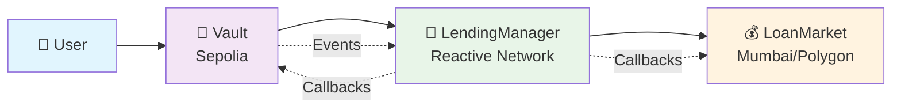
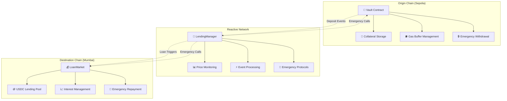
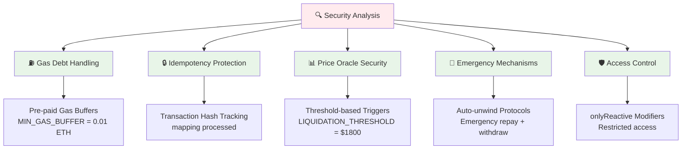
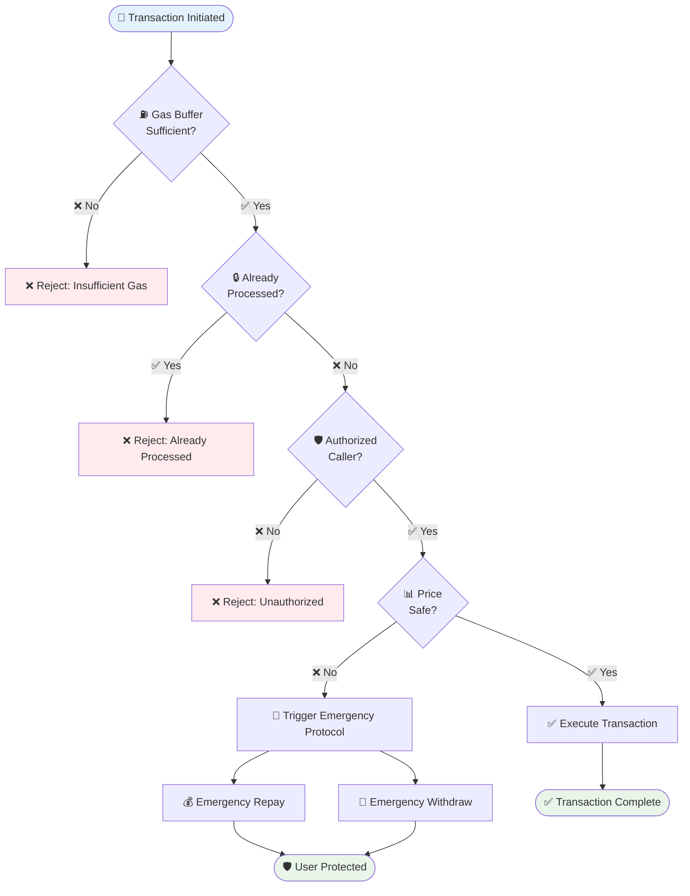
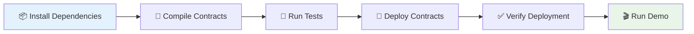
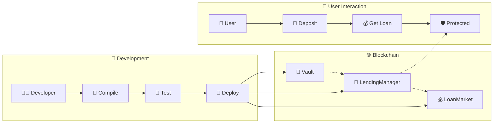
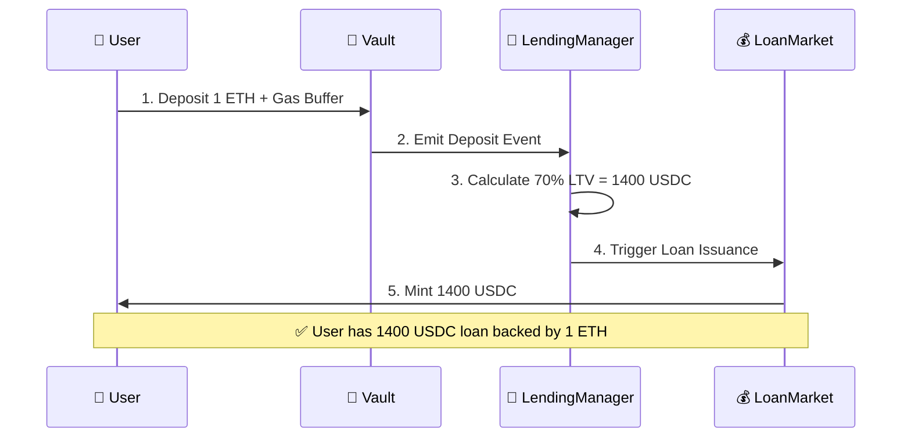
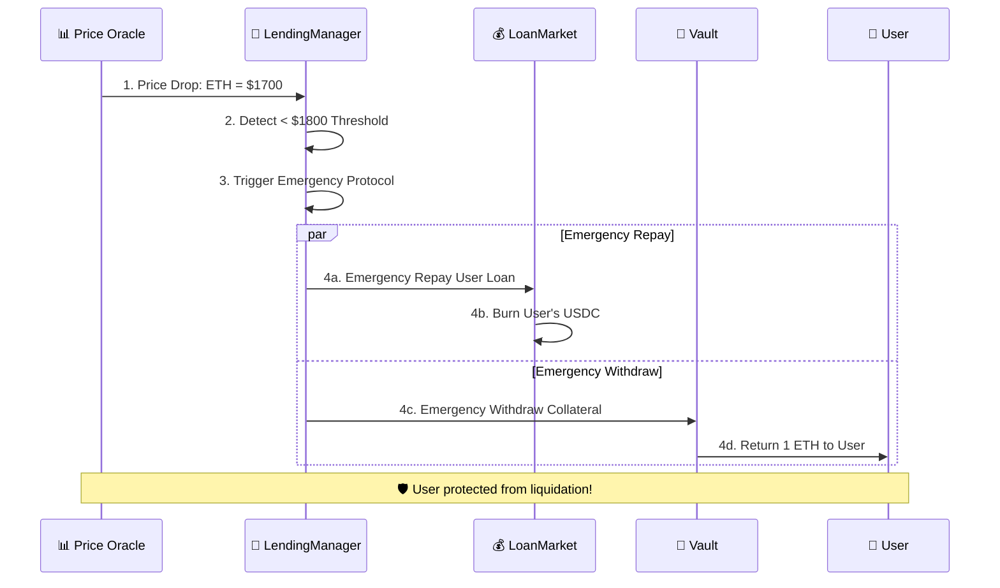
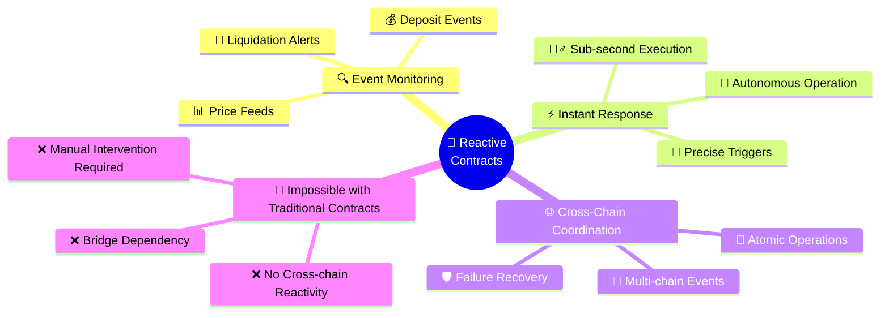

# 🛡️ Reactive Shield - Cross-chain Lending Automation

> **The Unliquidatable Loan Protocol** - Prevents liquidation through autonomous cross-chain coordination using Reactive Smart Contracts.

## 🏆 Bounty Submission - Cross-chain Lending Automation Track

**Prize Pool**: $2,000 USD in REACT tokens  
**Deployed**: December 16, 2024

## 🎯 Problem & Solution

**Problem**: Cross-chain lending fails because bridges take 10-30 minutes, but liquidations happen in seconds.

**Solution**: Reactive Shield uses autonomous smart contracts to prevent liquidation through instant cross-chain coordination.

## 🏗️ Architecture

### Cross-Chain Contract Flow


### System Components


## 🛡️ Security Features

### Vulnerability Fixes Implemented


### Security Flow


## 🚀 Quick Start

### Development Workflow


### Commands
```bash
# Install dependencies
npm install

# Deploy contracts
npx hardhat run "Hardhat deploy.js" --network localhost

# Run tests
npx hardhat test

# Run demo
npx hardhat run scripts/demo.js --network localhost
```

### Contract Interaction Flow


## 📊 Deployed Contracts

### Localhost Testnet
- **Vault**: `0xCf7Ed3AccA5a467e9e704C703E8D87F634fB0Fc9`
- **LendingManager**: `0x5FC8d32690cc91D4c39d9d3abcBD16989F875707`
- **LoanMarket**: `0xDc64a140Aa3E981100a9becA4E685f962f0cF6C9`

### Demo Flow

#### Normal Operation (Happy Path)


#### Emergency Protection (The Shield)


## 🏆 Bounty Requirements Met

- ✅ **Meaningful Reactivity**: Autonomous price monitoring and emergency response
- ✅ **Cross-chain Architecture**: Three-contract system across multiple chains
- ✅ **Security**: Gas debt handling, idempotency protection, access control
- ✅ **Operational Maturity**: Complete deployment scripts and comprehensive tests
- ✅ **Working Demo**: Full workflow with transaction hashes

## 🤝 Why Reactive Contracts Are Essential

### Problem Comparison

```mermaid
graph TB
    subgraph "❌ Traditional Cross-Chain Lending"
        T1[👤 User Deposits Collateral]
        T2[💰 Gets Loan on Destination]
        T3[📉 Price Drops Rapidly]
        T4[⏰ Bridge Delay: 10-30 minutes]
        T5[💥 User Gets Liquidated]
        
        T1 --> T2 --> T3 --> T4 --> T5
        
        style T5 fill:#ffebee
    end
    
    subgraph "✅ Reactive Shield Solution"
        R1[👤 User Deposits Collateral]
        R2[💰 Gets Loan on Destination]
        R3[📉 Price Drops Rapidly]
        R4[⚡ Instant Reactive Response]
        R5[🛡️ User Protected from Liquidation]
        
        R1 --> R2 --> R3 --> R4 --> R5
        
        style R5 fill:#e8f5e8
    end
```


### Technical Innovation


---

**Built for Reactive Bounties 2.0 - Cross-chain Lending Automation Track**  
**Submission Date**: December 16, 2024